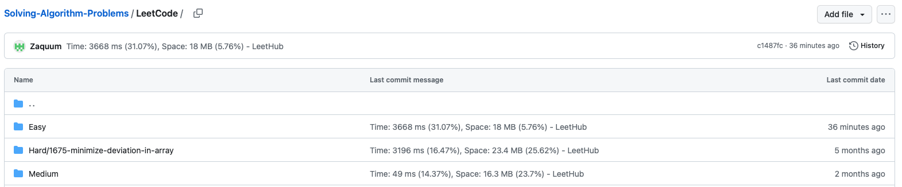

# How to set up LeetHub for Safari?

- Special Thanks to <b>arunbhardwaj</b>. <br> LeetHub-2.0 from <a href="https://github.com/arunbhardwaj/LeetHub-2.0">his repo</a>
<ol>
  <li>Fork this repo and clone to your local machine</li>
  <li>Customize Leethub setting in LeetHub-2.0 Folder. <br> You can upload your code accoding to <b>difficulty</b> under 'LeetCode' Folder with my current setting <br>
  
  </li>
  <li>Convert LeetHub into Safari extension. Please refer to <a href="https://developer.apple.com/documentation/safariservices/safari_web_extensions/converting_a_web_extension_for_safari">this article</a>. <br>
  Below is my command for running the convert. <br>
  It could vary with your setting <br>

  ```
  xcrun /Applications/Xcode.app/Contents/Developer/usr/bin/safari-web-extension-converter ./LeetHub-2.0
  ```
  </li>
  <li>Enjoy Your leetcode!!</li>
</ol>
