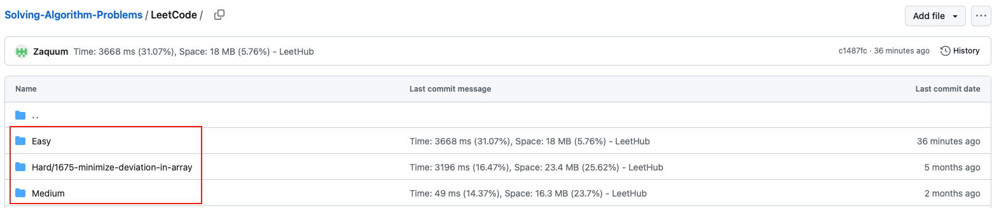

<h1> Leetcode with Safari or Chrome! </h1>

- Special Thanks to <b>arunbhardwaj</b>. <br> LeetHub-2.0 from <a href="https://github.com/arunbhardwaj/LeetHub-2.0">his repo</a>

# My Current Setting
- It works in the new version UI of Leetcode <br>
- LeetHub v2 : Safari Extension<br> LeetHub-2.0 : Chrome Extension
<h3><b>1.  Difficulty</b></h3>
&nbsp You can upload leetcode accoding to <b>difficulty</b> under 'LeetCode' Folder with my current setting

<div style="display: flex; justify-content: center;">
  
</div>

<br>
<h3><b>2. Badge</b></h3>
&nbsp Shields.io badge is applied. It varies with difficulty
<br>
<div style="display: flex; justify-content: center;">
  
</div>
<br>
<div style="display: flex; justify-content: center;">
  
</div>
<br>
<div style="display: flex; justify-content: center;">
  
</div>
<br>

# Set up LeetHub
<ol>
  <li>Fork this repo and clone to your local machine</li>
  <li>Customize Leethub setting in LeetHub-2.0 Folder (<u>Chrome Extension</u>) <br></li>
  <li><a href="https://developer.apple.com/documentation/safariservices/safari_web_extensions/converting_a_web_extension_for_safari">Convert</a> LeetHub into Safari extension. <br>
  Below is my command for running the convert. It could vary with your setting

  ```
  xcrun /Applications/Xcode.app/Contents/Developer/usr/bin/safari-web-extension-converter ./LeetHub-2.0
  ```

  Otherwise, you can just use my 'LeetHub v2' folder (<u>Safari Extension</u>)
  <li>Run the <a href="https://developer.apple.com/documentation/safariservices/safari_web_extensions/running_your_safari_web_extension">extension</a> on your Safari</li>
  </li>
  
  <li>Enjoy Your leetcode!!</li>
</ol>